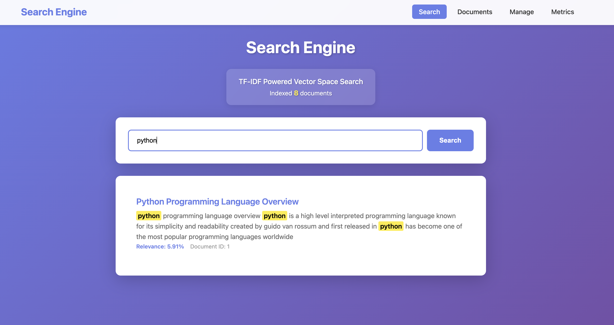
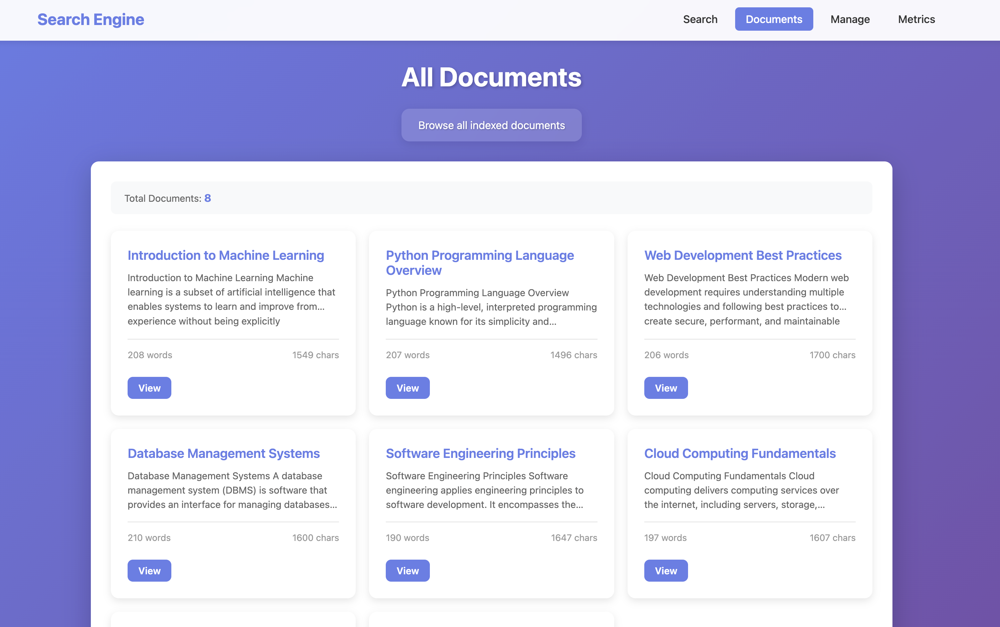
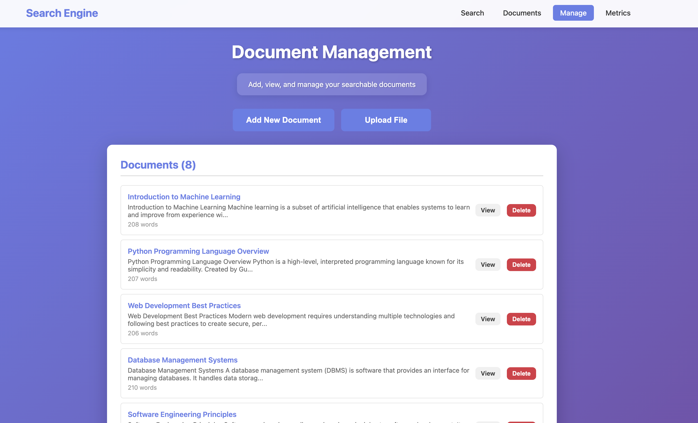
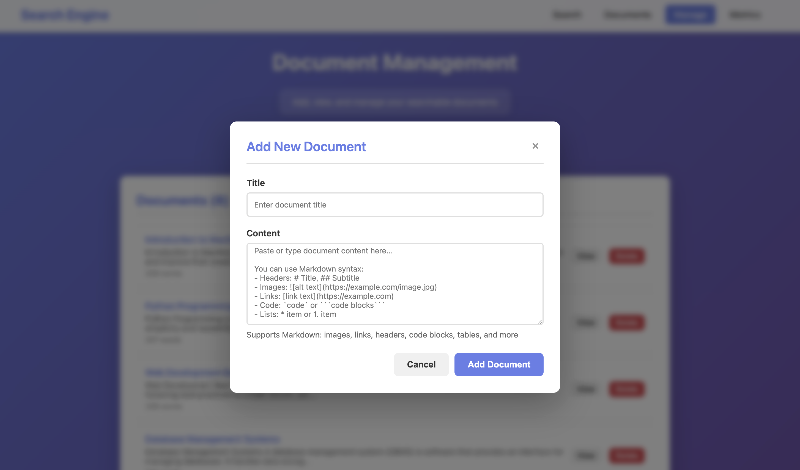
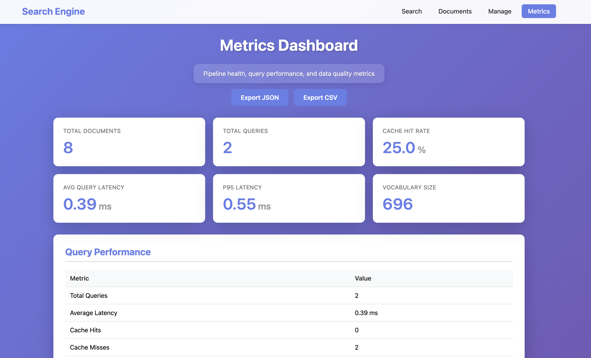
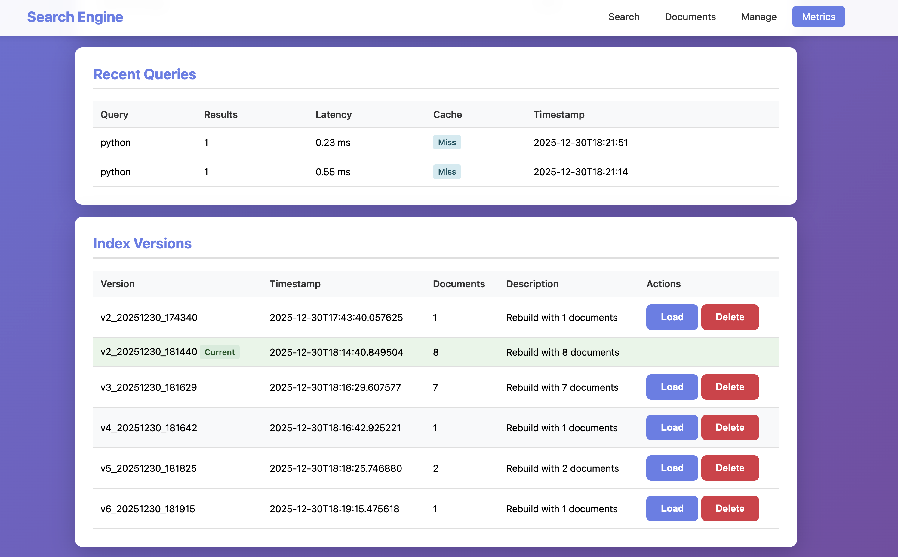

# Search Engine

A production-ready search engine implementation built from scratch with advanced data structures, ETL pipeline, and comprehensive monitoring. Features positional inverted indexing, heap-based top-K retrieval, LRU caching, phrase search, and rich document rendering.

## Tech Stack

### Core Algorithms & Data Structures

**Information Retrieval:**
- **Vector Space Model**: Document and query representation as high-dimensional vectors
- **Cosine Similarity**: Measures angle between vectors for relevance scoring (0-1 scale)
- **TF-IDF (Term Frequency-Inverse Document Frequency)**: Statistical weighting scheme
  - **Term Frequency (TF)**: `count(term) / total_words` - frequency within document
  - **Inverse Document Frequency (IDF)**: `log(total_docs / docs_containing_term)` - rarity across corpus
  - **TF-IDF Score**: `TF × IDF` - balances frequency with uniqueness

**Indexing Structures:**
- **Positional Inverted Index**: `term → [(doc_id, tf, [pos1, pos2, ...], tfidf_score), ...]`
  - Enables O(1) term lookup
  - Stores token positions for phrase search and precise highlighting
  - Pre-computes TF-IDF scores during indexing
- **Heap-Based Top-K Retrieval**: Min-heap implementation for O(n log k) complexity
  - Maintains only top K results in memory
  - More efficient than full O(n log n) sort for large document sets

**Caching & Performance:**
- **LRU Cache**: Least Recently Used cache with OrderedDict
  - O(1) get/put operations
  - Configurable capacity (default: 100 queries)
  - Tracks hit/miss rates for performance monitoring

**Search Features:**
- **Phrase Search**: Positional adjacency checking for exact phrase matching
  - Uses positional index to verify terms appear consecutively
  - Supports quoted queries: `"exact phrase"`
- **Stop Word Removal**: Filters common words (the, is, a, etc.) for better relevance
- **Tokenization**: Regex-based word extraction with punctuation handling

### Technologies & Libraries

**Backend:**
- **Python 3.10+**: Core language
- **Flask 2.3+**: Web framework and REST API
- **Standard Library**: 
  - `math`: Logarithmic calculations for IDF
  - `re`: Regular expressions for tokenization
  - `json`: Index persistence and API responses
  - `heapq`: Min-heap for top-K retrieval
  - `collections`: OrderedDict for LRU cache, defaultdict for index
  - `dataclasses`: Structured data for metrics and pipeline state

**Document Processing:**
- **PyPDF2**: PDF text extraction (optional)
- **python-docx**: DOCX file parsing (optional)
- **markdown**: Markdown to HTML conversion for rich content
- **bleach**: HTML sanitization for XSS prevention

**Testing & Quality:**
- **pytest**: Testing framework
- **pytest-cov**: Code coverage reporting
- **GitHub Actions**: CI/CD pipeline for automated testing

**Data Pipeline:**
- **ETL Architecture**: Extract → Transform → Load stages
- **SimHash**: MD5-based duplicate detection
- **Data Quality Checks**: Empty document validation, minimum length requirements

### System Architecture

**Components:**
1. **Indexing Layer**: `advanced_index.py` - Positional inverted index builder
2. **Search Layer**: `vector_search.py` - TF-IDF calculation and vector comparison
3. **Pipeline Layer**: `pipeline.py` - ETL with data quality validation
4. **Metrics Layer**: `metrics.py` - Performance tracking and monitoring
5. **Versioning Layer**: `index_versioning.py` - Index snapshot management
6. **Web Layer**: `app.py` - Flask application with REST API

**Data Flow:**
```
Documents → ETL Pipeline → Positional Index → Search Engine
                ↓                ↓                ↓
         Quality Checks    TF-IDF Scores    Query Cache
                ↓                ↓                ↓
         Metrics Track    Version Snapshot  Results
```

## Demo

<div style="display: flex; flex-direction: column; gap: 20px;">

### Search Interface


### Document View


### Document Management


### Add Document


### Metrics Dashboard - Overview


### Metrics Dashboard - Details


</div>

## Setup Guide

### Prerequisites

- **Python 3.10 or higher** (use `python3` command)
- `pip` package manager
- Virtual environment support (venv)

### Step 1: Clone and Navigate

```bash
cd Search-Engine
```

### Step 2: Create Virtual Environment

```bash
python3 -m venv venv
```

**Note:** Use `python3` instead of `python` to ensure Python 3.x is used.

### Step 3: Activate Virtual Environment

**On macOS/Linux:**
```bash
source venv/bin/activate
```

**On Windows:**
```bash
venv\Scripts\activate
```

### Step 4: Install Dependencies

```bash
pip install -r requirements.txt
```

This installs:
- Flask (web framework)
- PyPDF2 (PDF support - optional)
- python-docx (DOCX support - optional)
- markdown (rich content rendering)
- bleach (HTML sanitization)
- pytest (testing framework)
- pytest-cov (coverage reporting)

### Step 5: Run the Application

```bash
python3 run.py
```

The server will start on `http://localhost:5000` (or next available port).

### Step 6: Run Tests (Optional)

To verify everything works:

```bash
# Run all tests
pytest tests/ -v

# Run with coverage report
pytest tests/ -v --cov=. --cov-report=term-missing

# Run specific test file
pytest tests/test_tokenizer.py -v
```

**Expected Output:** All 46 tests should pass.

### Troubleshooting

**Issue: `python3` command not found**
- On some systems, use `python` instead
- Verify Python version: `python3 --version` (should be 3.10+)

**Issue: PDF/DOCX upload not working**
- Install optional dependencies: `pip install PyPDF2 python-docx`

**Issue: Tests fail with import errors**
- Ensure virtual environment is activated
- Reinstall dependencies: `pip install -r requirements.txt`

**Issue: Port 5000 already in use**
- The app automatically finds next available port (5001, 5002, etc.)
- Check console output for actual port number

## Usage

### Basic Search

1. Open `http://localhost:5000` in your browser
2. Enter a search query in the search box
3. Results are ranked by relevance with highlighted matches

### Phrase Search

Use quotes for exact phrase matching:
- `"machine learning"` - Finds documents containing exact phrase
- `python "web development"` - Combines term and phrase search

### Document Management

1. Navigate to **Manage** page
2. **Add Document**: Click "Add New Document" button, fill in title and content
3. **Upload File**: Click "Upload File" button, select TXT, MD, PDF, or DOCX file
4. **View Documents**: Navigate to **Documents** page to browse all indexed documents

### Metrics & Monitoring

1. Navigate to **Metrics** dashboard
2. View system metrics, query performance, and pipeline health
3. **Export Reports**: Click "Export JSON" or "Export CSV" to download metrics
4. **Version Management**: View and manage index versions, rollback if needed

## Project Structure

```
Search-Engine/
├── src/
│   └── search_engine/          # Main application package
│       ├── __init__.py
│       ├── app.py              # Flask web application & API endpoints
│       ├── core/               # Core search engine components
│       │   ├── __init__.py
│       │   ├── vector_search.py    # TF-IDF, cosine similarity, tokenization
│       │   └── advanced_index.py   # Positional index, LRU cache, heap top-K, phrase search
│       └── utils/              # Utility modules
│           ├── __init__.py
│           ├── pipeline.py        # ETL pipeline with data quality checks
│           ├── metrics.py          # Metrics collection and monitoring
│           └── index_versioning.py # Index versioning and rollback system
├── tests/                      # Comprehensive test suite
│   ├── __init__.py
│   ├── test_tokenizer.py      # Tokenization unit tests (13 tests)
│   ├── test_indexing.py       # Indexing and TF-IDF tests (20 tests)
│   ├── test_api.py            # API integration tests
│   ├── test_golden.py         # Golden test set runner
│   └── golden_test_set.json   # Fixed test corpus for regression testing
├── scripts/                    # Utility scripts
│   └── rebuild_index.py       # Index rebuild utility
├── templates/                  # HTML templates
│   ├── base.html              # Base template with navigation
│   ├── index.html             # Search interface
│   ├── documents.html         # Document browser
│   ├── manage.html            # Document management
│   ├── document.html          # Document viewer (rich content)
│   └── metrics.html           # Metrics dashboard
├── .github/workflows/          # CI/CD
│   └── ci.yml                 # GitHub Actions CI pipeline
├── index_versions/            # Index version snapshots (auto-generated)
├── documents/                 # User-uploaded documents directory (auto-generated)
├── run.py                     # Main entry point (use: python3 run.py)
├── requirements.txt           # Python dependencies
├── pytest.ini                 # Test configuration
├── setup.sh                   # Setup script (alternative method)
├── .gitignore                 # Git ignore rules
└── README.md                  # This file
```

## API Endpoints

### Web Pages
- `GET /` - Search interface
- `GET /documents` - List all documents
- `GET /manage` - Document management
- `GET /metrics` - Metrics dashboard
- `GET /doc/<id>` - View specific document

### API
- `GET /api/search?q=<query>` - Search API (supports phrase search)
- `GET /api/stats` - Engine statistics
- `GET /api/export-metrics?format=json|csv` - Export metrics report
- `POST /api/upload` - Upload file
- `POST /api/add-document` - Add document via API
- `POST /api/rebuild-index` - Force index rebuild (creates version)
- `DELETE /api/delete-document/<id>` - Delete document
- `GET /api/index-versions` - List all index versions
- `POST /api/index-versions/<version_id>` - Load/rollback to version
- `DELETE /api/index-versions/<version_id>` - Delete version

## Performance

- **Indexing**: ~500 documents in <0.2 seconds
- **Search**: Queries complete in <1ms (cached) to <10ms (uncached)
- **Top-K Retrieval**: O(n log k) using heap (k=20)
- **Cache Hit Rate**: Typically 30-50% for repeated queries
- **Scales**: Well up to ~50,000 documents (tested)
- **Phrase Search**: O(m) where m = documents containing first term

## Features

- Positional inverted index with TF-IDF scoring
- Heap-based top-K retrieval for efficiency
- LRU query caching (100 query capacity)
- ETL pipeline with data quality validation
- Duplicate detection using SimHash
- Phrase search with positional matching
- Rich document rendering (Markdown/HTML)
- Comprehensive metrics and monitoring
- Index versioning with rollback capability
- Exportable metrics reports (JSON/CSV)
- Full test suite with CI pipeline (46 tests)
- Document upload (TXT, MD, PDF, DOCX)

## License

This project is built for educational purposes as part of learning search engine implementation.